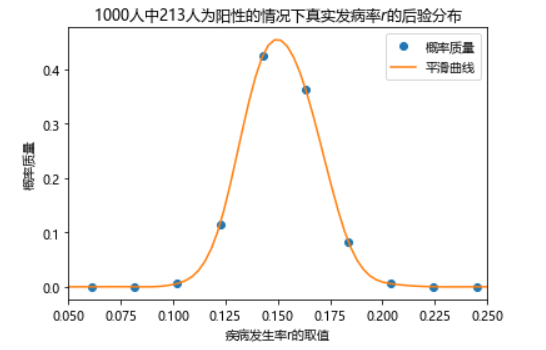

章节3 (朱奎松2019302130040)
# **分层模型**
&ensp;&ensp;&ensp;&ensp;该章是建立在复杂统计模型基础上进行展开的，众所周知生活中的很多统计模型并不是只存在一个参数，而相比较之下，多参数的统计模型问题在生活中更加常见，而随着社会的发展，统计问题的参数变得原来越多，维数也变得越来越大，所以现在急需一套独特的体系方法去解决这些问题。 
&ensp;&ensp;&ensp;&ensp;本章的主要内容则是针对于构建分层贝叶斯模型这一方法展开的，层次贝叶斯模型是一种具有结构化层次的统计模型，它可以用来为复杂的统计问题建立层次模型从而避免参数过多导致的过拟合问题。实际中，简单的非层次模型可能并不适合层次数据：在很少的参数情况下，它们并不能准确适配大规模数据集，然而，过多的参数则可能导致过拟合的问题。相反，层次模型有足够的参数来拟合数据，同时使用总体分布将参数的依赖结构化，从而避免过拟合问题。具体的构建过程将在下文提到。 
&ensp;&ensp;&ensp;&ensp;本章节的结构如下：
## **3.1 基本概念**
&ensp;&ensp;&ensp;&ensp;对于一个未知总体，我们往往关心的是能反映出该总体情况的未知参数$\theta$，即似然函数$p(x|\theta)$中的$\theta$参数。而无论是传统统计学还是贝叶斯统计学，其建立的最终目的都是希望可以合理地利用已知数据来对未知参数进行最优的估计，使该参数可以最好地拟合真正的参数。由此，利用已知推测未知，利用样本估计总体已然成为统计学的根本目的。
### 3.1.1 贝叶斯模型和贝叶斯分层模型的区别
* 贝叶斯模型 
&ensp;&ensp;&ensp;&ensp;上面提到，通过已知推测未知，通过样本估计总体是统计学的根本目的。在此章节，将不再对传统统计学进行阐述，本章节主要讨论的是贝叶斯统计学。下面先对贝叶斯统计学进行阐述，下面先看一个公式：$$p(\theta|y)=p(y|\theta)p(\theta)/p(y)\propto p(y|\theta)p(\theta)\tag{3.1}$$贝叶斯体系正是围绕着上面的公式展开的，这里的$p(\theta|y)$是后验概率，$p(y|\theta)$是似然函数，即给定$\theta$的$y$的分布函数，而$p(\theta)$被称为先验概率。而我们要估计的就是这个$\theta$，估计这个参数一般采用的是最大后验概率法（MAP），即想办法使$p(\theta|y)$达到最大来估计$\theta$。通常来说，我们有时候会出现缺少先验知识，即先验概率比较难获得的情况，这是我们经常遇到的问题，这时我们往往采用在区间中扁平的均匀分布来作为非主观先验分布或被叫做无信息先验分布，随即利用该分布与似然函数$p(y|\theta)$相乘，最终推导出后验分布.
* 贝叶斯分层模型 
&ensp;&ensp;&ensp;&ensp;所谓分层，分的是层级关系；所谓层级，就是将原本的参数作为变量继续进行估计。拿上面的贝叶斯模型进行举例。刚刚讨论了贝叶斯模型的目标是通过$\theta$的先验分布来估计 $\theta$的后验分布。现在经过研究，我们发现$\theta$的先验分布会受其他因素的影响，我们需要通过额外数据来估计$\theta$的先验，假设有：$$\theta\sim p(\theta|\varphi)$$ $$\varphi\sim p(\varphi)$$ $$p(\theta,\varphi)=p(\theta|\varphi)p(\varphi)$$ 其中$\varphi$被称为超参数，用来衡量决定参数$\theta$的未知因素；$p(\varphi)$被称为超参数先验分布。据此可知，传统的贝叶斯后验概率将会发生一些更改，式3.1变为如下公式：$$p(\theta,\varphi|y)\propto p(\theta,\varphi)p(y|\theta,\varphi)=p(\theta,\varphi)p(y|\theta)\tag{3.2}$$上式为参数$\theta$和超参数$\varphi$的联合后验概率，不知不觉间我们已经成功构建了两层的贝叶斯结构。第一层是针对$\theta\sim y$而构建的贝叶斯模型，第二层是针对$\varphi\sim \theta$而构建的贝叶斯模型，接着在参数估计方面，思路与上面的贝叶斯模型的思路大致是一样的，但是随着层数的增加，可想而知，联合后验概率将会难以用图像进行表示，在这里我们将引入仿真的概念具体实例我们将在后面说到。
### 3.1.2 可交换性&互换性
&ensp;&ensp;&ensp;&ensp;在做对总体参数进行估计的实验中，假设共做了$j$次试验，每一次实验都相应的得出了一个参数$\theta_j$，所谓可交换性，是如果除了数据没有任何其他信息可以帮助我们区别$\theta_j$，并且参数没有顺序且无法分组，必须假设参数在先验分布中是对称的。这种对称性在概率中可以用互换性表示。即如果$p(θ_1, …, θ_j)$对索引的排列来说是不变的，那么参数$(θ_1, …, θ_j)$是可交换的。从数据中直接构造独立同分布模型的时候，我们已经遇到了互换性的概念。实际中，未知意味着互换性。一般情况下，我们知道得越少，我们越可以使用互换性。但这不意味着我们要限制我们对问题的了解。可交换的分布的一个最简单的形式是对于每一个参数θj，可以当作是从先验分布中获得的一个独立的样本，先验分布有一组未知的参数向量φ控制，因此有公式（3.3）：$$p(\theta|\varphi)=\prod_{j=1}^Jp(\theta_j|\varphi)\tag{3.3}$$而一般情况下，$\varphi$是未知参数，则将式3.3中的$\varphi$的随机性消除变为如下式3.4：$$p(\theta)=\int_{}^{}(\prod_{j=1}^Jp(\theta_j|\varphi))p(\varphi)d\varphi\tag{3.4}$$这个形式是混合的独立同分布形式，经常会用来说明实际中的互换性。
### 3.1.3 联合信息的逻辑
&ensp;&ensp;&ensp;&ensp;这主要表现在下面情况，想象一下当你经过两次试验后，分别通过先验概率求出了两组实验的参数$\theta_j$，并发现两组参数先验分布有很大的相似性，当经过数据分析发现，其中一个的参数值明显低于或高于原有的期望值，那么这里你就会很自然的想另一个参数是否估计正确，并且会有意的向第一个参数那样偏移。这便是联合信息产生的逻辑。
## **3.2 基于贝叶斯层次模型的参数估计**
&ensp;&ensp;&ensp;&ensp;3.1.1中提到平常遇到的问题多半是多参数问题，但是这样也会产生各种各样的问题，如可能会出现过拟合现象，会出现维灾难。最主要的是，我们很难去表示一个有很多参数的联合后验概率。而为了解决这样的问题，我们提出仿真的策略。对于维数较多这个问题，我们一个很自然的想法便是降维，而对于联合概率分布来说，求其边缘概率分布再合适不过了：
### 3.2.1 条件分布和边缘分布的分析推导
&ensp;&ensp;&ensp;&ensp;对此，我们先做出如下三步分析：
* 写出联合后验密度$p(\theta, \varphi|y)$，其形式是超先验分布p(φ)、总体分布$p(\theta|\varphi)$和似然函数$p(y|\theta)$的乘积。
* 在给定超参数$\varphi$的情况下，确定$\theta$的条件后验密度。固定观测值$y$的情况下，它是$\varphi$的函数即$p(\theta|\varphi, y)$。
* 使用贝叶斯分析范例估计$\varphi$。也就是要获取边缘后验分布，$p(\varphi|y)$。

&ensp;&ensp;&ensp;&ensp;下面对上面三点进行一一阐述，思考一下，假设你经过$n$次试验，并获得了这些次试验的观测值矩阵$Y$以及这些次试验的参数估计向量$\theta$，并由贝叶斯模型可知，$\theta\sim p(\varphi)$，满足参数为$\varphi$的分布，根据贝叶斯分层模型可得联合后验概率为：$$p(\theta,\varphi|y)\propto p(\theta,\varphi)p(y|\theta,\varphi)=p(y|\theta)p(\theta|\varphi)p(\varphi)\tag{3.5}$$ 
&ensp;&ensp;&ensp;&ensp;这便是完成了第一步，对于第二步，在给定参数$\varphi$，固定观测值$y$的情况下，由式3.1即可算出$p(\theta|\varphi,y)$，到了第三步，容易想到的是在式3.5上对$\theta$求积分：$$p(\varphi|y)=\int_{}^{}p(\theta,\varphi|y)d\theta\tag{3.6}$$ 
&ensp;&ensp;&ensp;&ensp;而对于很多标准的模型，还可以使用条件分布的方法对$p(\varphi|y)$进行计算：$$p(\varphi|y)=\frac{p(\theta,\varphi|y)}{p(\theta|\varphi,y)}\tag{3.7}$$ 
&ensp;&ensp;&ensp;&ensp;有了上面的分布，我们便有了估计超参数$\varphi$的方法。
### 3.2.2 从后验分布中获取仿真结果
&ensp;&ensp;&ensp;&ensp;上文中已经成功得到了边缘后验概率$p(\varphi|y)$，而我们需要从他们的身上获取仿真信息，对此可以使用如下策略：
* 给定$\varphi$的情况下，从条件后验分布$p(\theta|\varphi, y)$中获取参数向量$\theta$。如本章的例子，当分解$p(\theta|\varphi, y) =\prod_{j=1}^Jp(\theta_j|\varphi, y)$成立时候，$\theta_j$可以独立的获取。
* 如果可以的话，给定$\theta$的情况下，从后验预测分布中预测$y^\sim$的值。依赖于这个问题，可能需要先获取一个新的值$\theta^\sim$。

&ensp;&ensp;&ensp;&ensp;我们甚至可以将上述步骤循环$L$次。从$\theta$和$y^\sim$的联合后验分布中我们可以计算任意估计量或者预测量。
## **3.3 贝叶斯分层模型的参数估计**
&ensp;&ensp;&ensp;&ensp;由上面章节可知，贝叶斯分层模型是基于可交换性的基础建立起来的，他分层的数量可以是两层，也可以是多层，如果只考虑两层，则联合后验概率的分布就如式3.5，当然它也可以产生3层或者更多，如，$$p(\theta,\varphi,x|y)=\frac{p(y|\theta)p(\theta|\varphi)p(\varphi|x)p(x)}{p(y)}\tag{3.8}$$那么上述模型如何做出预测呢？根据可交换性可知，从一个群体中独立的进行采样样品间可以看做是可交换的。这个群体由一个未知参数$\varphi$来描述：$$\varphi\sim p(\theta)$$ $${Y_1,Y_2,...,Y_n|\varphi}\sim^{i.i.d} p(y|\varphi)$$上面每一个$Y_i$都包含了$j$个数据，按照分层的思想，就产生了以下三个模型：$${Y_{1,j},...,Y_{n_j,j}}\sim^{i.i.d} p(y|\varphi_j)$$ $${\varphi_1,\varphi_2,...,\varphi_n|\varphi}\sim^{i.i.d} p(\varphi|\phi)$$ $$\phi\sim p(\phi)$$这样便产生了组间和组内的差异，分别是反映组内差异的$\varphi_j=N(\theta_j,\sigma^2)$以及组间差异的$\phi=N(\mu,\tau^2)$，模型已经建立完毕，下面就是要估计这些参数，而说起估计方法，就不得不提蒙特卡洛方法以及马尔科夫链蒙特卡洛方法（MCMC）。
### 3.3.1 蒙特卡洛方法
&ensp;&ensp;&ensp;&ensp;蒙特卡洛算法运用了大数定律，其主要思想是当你想要对一随机变量$x$的函数求期望，即$E[h(x)]$，$h(x)$为随机变量函数，而根据期望公式可知，有$$E[h(x)]=\int_{}^{}h(x)\pi(x)dx\tag{3.9}$$当然，如果直接对上式进行积分并不是一件容易的事，更何况，当$x$的维数变得巨大，积分更成为了不可能。 
&ensp;&ensp;&ensp;&ensp;于是，蒙特卡洛算法诞生了，它的主要思想是，取$(x_1,x_2,...,x_j)$ j个来自$X$的变量，于是根据大数定理可知：$$\lim_{n \to \infty}{\frac{1}{n}\sum_{i=1}^{n}h(x^{(i)})}=E[h(x)]\tag{3.10}$$这就是蒙特卡洛算法最基本的公式。
### 3.3.2 MCMC算法
&ensp;&ensp;&ensp;&ensp;MCMC算法融合了马尔科夫链的无记忆性，对此不再赘述，它的主要过程是模拟了一个自选初始点$\theta^(0)$的离散时间马尔科夫链，并产生了一串相依的随机变量，实际上，这一过程实则是帮助蒙特卡洛算法进行抽样。而实用马尔可夫链进行抽样，关键是设计一个合适的转移矩阵，以便生成的链大道与目标匹配的稳定分布。
&ensp;&ensp;&ensp;&ensp;有了马尔科夫链的性质配以蒙特卡洛算法，使得MCMC算法是当前的一个比较流行的算法。
## **3.4 贝叶斯分层模型代码实例**
&ensp;&ensp;&ensp;&ensp;上面已经完整论述了建立贝叶斯分层模型的全部过程与理论，下面我们将要利用python来对贝叶斯分层模型进行建模分析，以对其实用意义有一个更好的了解。
### 3.4.1 分层贝叶斯在疾病筛查方面的应用
&ensp;&ensp;&ensp;&ensp;假设有这样一项医学筛查技术，测试结果显示为假阳性的概率为0.15，假阴性率为0.1。在一次筛查中，随机对1,000人进行了检测，结果为阳性的有213人。该病在人群中发病率的后验分布是什么？ 
&ensp;&ensp;&ensp;&ensp;根据问题，首先对变量进行定义：
* 令$N$为参与测试人数，这里$N=1000$
* $p$为检测出的阳性人数，这里$p=213$
* 令$p_t$为真阳性的人数
* 令$d$为患病人数
* 令$r$为发病率

&ensp;&ensp;&ensp;&ensp;根据贝叶斯定理，可知：$$P(r|p)=\frac{P(r)\cdot P(p|r)}{\sum_{r\in R}^{}P(r)\cdot P(p|r)}\tag{3.11}$$
&ensp;&ensp;&ensp;&ensp;其中：
* $P(r)$为参数$r$的先验分布，在这里我们假设其服从（0,1）区间上的均匀分布；
* $P(p|r)$为似然函数

&ensp;&ensp;&ensp;&ensp;当假设一个人患病后被检测为阳性的概率为1，不患病被检测为阳性的概率为0时，我们仅考虑参数$r$和$p$的贝叶斯模型是合理的，因为此时认为被检测为阳性的人一定为患病的人。可是当检测出现误差时，便不能这样考虑，于是我们引入中间变量$p_t$，建立贝叶斯层次模型，于是可以得到一个联合似然函数：$$P(p,p_t,d|r,N)$$&ensp;&ensp;&ensp;&ensp;通过该式，我们可以求得$p$的边缘概率密度函数：$$P(p|r,N)=\sum_{i}^{}\sum_{j}^{}P(p|p_{tj},r,N)\cdot P(p_{tj}|d_i,r,N)\cdot P(d_i|r,N)\tag{3.12}$$&ensp;&ensp;&ensp;&ensp;这样，我们便成功地得到了$P(p|r)$似然函数，并将它带入到3.8式中即可得出关于$r$的后验分布。另外，3.12式中右侧的每一项都可以用二项分布来表示，具体分布将在代码处进行说明。
### 3.4.2 代码实现
&ensp;&ensp;&ensp;&ensp;分析过问题，我们利用python来对该题进行求解，主要代码如下：
~~~[Python]
from tools import Suite
from scipy.stats import binom  # 二项分布
from numpy import linspace     # 插值
from matplotlib import pyplot as plt   #作图
from scipy.interpolate import interp1d   #作图

class MedicalTest(Suite):
    """医学筛查的分层贝叶斯模型。"""
    
    def __init__(self, n=50, r_fn=0.15, r_fp=0.1,Name=None):
        """初始化。
        
        参数：
            setp,先验r在（0，1）区间上取值的步长；
            r_fn,假阴性占比
            r_fp,假阳性占比
        """
        self.r_fn = r_fn
        self.r_fp = r_fp
        # r的先验分布
        rs = linspace(0,1,n)
        Suite.__init__(self, rs, name=None)
    
    def Likelihood(self, data, hypo):
        """给定假设的似然函数。        

        data: 元组（N,p）,其中N为参与测试人数，p为测试结果为阳性人数。
        hypo: 先验分布概率值
        """
        N = data[0]
        p = data[1]
        r = hypo
        # 得病人数分布
        d_range = range(N + 1) 
        # 真阳性的人数分布
        p_t_range = range(p + 1)
        
        total = 0
        for d in d_range:   # 两个循环，对应(3)式中两次求和
            for p_t in p_t_range:   
                p1 = binom.pmf(p - p_t, N - d, self.r_fp)  # 概率分布(4)
                p2 = binom.pmf(p_t, d, (1 - self.r_fn))    # 概率分布(5)
                p3 = binom.pmf(d, N, r)                    # 概率分布(6)
           
                total += (p1 * p2 * p3)
   
        return total

suite = MedicalTest() #计算后验概率
suite.Update((1000,213)) #最后经过计算得出0.0013
# 做出参数r的后验分布图

x,y = zip(*suite.Items())
xs = linspace(0,0.3,100)
# 因计算时间太长，模型中r的点密度较为稀疏
# 计算出后验后，通过插值平滑后验分布图形
f2 = interp1d(x, y, kind='cubic')
# 作图
plt.plot(x,y,'o',xs,f2(xs),'-')
plt.legend(['概率质量', '平滑曲线'], loc='best')
plt.title('1000人中213人为阳性的情况下真实发病率$r$的后验分布')
plt.xlabel('疾病发生率r的取值')
plt.ylabel('概率质量')
plt.xlim(0.05,0.25)
plt.show()
~~~
最终结果如下：

&ensp;&ensp;&ensp;&ensp;由图中可以看出，参数$r$的最佳取值范围在0.125~0.15之间。上面是完整的贝叶斯分层模型的应用与代码求解。
